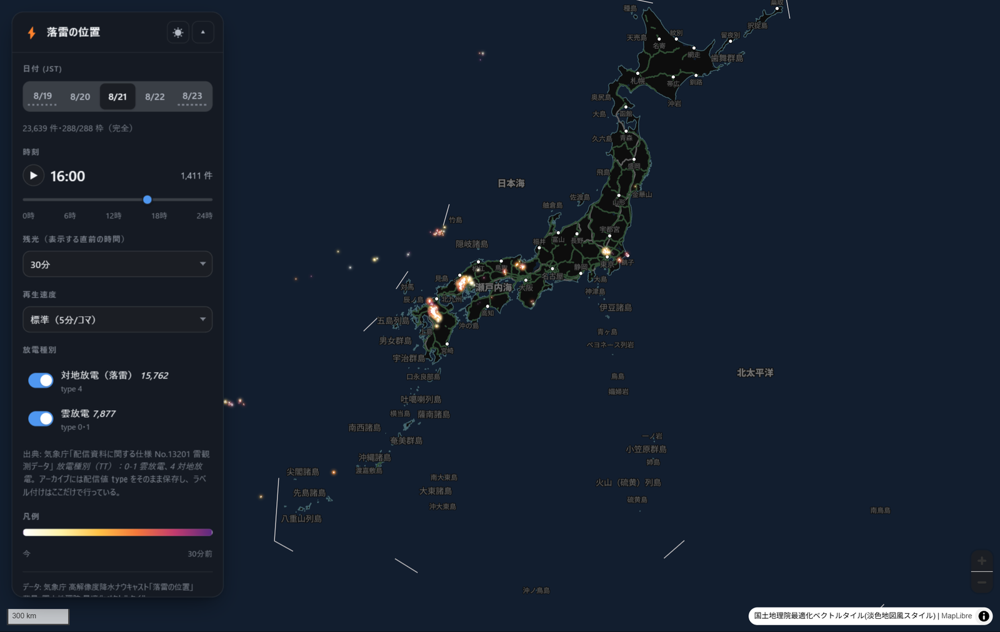

# jma-liden-tile-pipeline

気象庁ナウキャストの「落雷の位置」（liden）を取得して **PMTiles** にし、
MapLibre のタイムラプスで見る。雷雨のときに手で叩いて最新を見るためのもの。



- 出典: 気象庁 高解像度降水ナウキャスト（落雷の位置）
- ライセンス: コードは Apache-2.0 / データは気象庁ホームページ利用規約（出典明示で利用可）

## いちばん大事な制約：配信は約5日で消える

**5日より古い落雷はこの配信から取れない。** 実測で 5日前=200 / 5日6時間前=404。

- 走らせなかった期間は**永久に欠ける**（このリポジトリは定期収集をしていない）
- 逆に、**気づいてから5日以内なら遡れる**。「昨日の夕方すごかった」は翌日でも間に合う
- 5日より前が必要なら[別ルートで買う](docs/DATA.md#5日より前の落雷が欲しいとき)

## 使い方

### GitHub 上で実行する（ローカル環境不要）

雷雨に気づいたら Actions の **`collect liden`** を `Run workflow` するだけ。
取得 → アーカイブのコミット → PMTiles 生成 → **公開サイトの更新**まで通る。
既定で**配信に残っている 5 日ぶん全部**（`hours` = 120）を取りに行くので、
しばらく回していなくても直近5日が揃う。`hours` を縮めれば短く済ませられる。
スマホのブラウザからでも実行できる。

[](https://github.com/shiwaku/jma-liden-tile-pipeline/actions/workflows/collect.yml)

### ローカルで実行する

WSL の tippecanoe を使ってローカルで完結させる場合:

```powershell
.\refresh.ps1              # 直近3時間を取得 → タイル生成 → ビューア起動
.\refresh.ps1 -Hours 12    # 直近12時間
.\refresh.ps1 -Hours 48    # 昨日の分まで
.\refresh.ps1 -NoViewer    # 取得とタイル生成だけ
```

直近3時間なら **約30秒**（36スライス）。指定できるのは実質 `-Hours 120` まで。

PowerShell を使わない場合:

```bash
python scripts/refresh.py --hours 3   # 上と同じ（collect → normalize → build）
cd viewer && npm install && npm run dev
```

表示された URL をブラウザで開く。初回だけ `npm install` が必要。

### 個別に動かす

```bash
python scripts/collect.py     # 未取得スライスを取る（--window-days N）
python scripts/normalize.py   # raw → archive/（恒久アーカイブ）
python scripts/build.py       # archive/ → dist/*.pmtiles
python scripts/status.py      # どこが取れていて、どこがもう取れないか
python scripts/prune.py       # 取り直せない raw キャッシュを掃除（--apply で実行）
```

`make` が使える環境なら `make refresh HOURS=12` / `make status` など。

**ローカル実行は公開サイトを更新しない。** 公開サイトも更新するなら
`make deploy-pages`（ビューアをビルドして `dist/` の PMTiles を同梱し
`gh-pages` へ force push）を続けて叩く。GitHub 上で実行した場合は
`deploy_pages` が既定で on なので、そのまま公開サイトまで反映される。

## ビューアでできること

- **タイムラプス再生は5日通し。** 時刻スライダーは直近5日ぶんが1本に繋がって
  いて、**日をまたいでも止まらない**（真夜中でタイルは自動で切り替わる）。
  速度は 1 / 2 / 5 / 15 分/コマ。カーソルは分単位で動く
  （配信の5分刻みより細かい。観測時刻はミリ秒まで入っているため）
- **日付タブはその日へ飛ぶボタン。** **出るのは直近5日ぶん**（配信保持に
  合わせている）。未取得の時間帯がある日は下線を破線にして `枠/288` を出す。
  欠けている日を欠けていないように見せない。
  絞っているのは表示だけで `archive/` は消さないので、
  `viewer/src/main.ts` の `VISIBLE_DAYS` を増やせば過去の日も出せる
- **残光** — 直前5分〜3時間、または1日ぶんすべて。残光モードでは経過時間で
  色が変わる（白→黄→橙→赤紫）ので、同じ場所の古い点と新しい点が区別できる
- **放電種別フィルタ** — 対地放電（落雷）／雲放電
- クリックで1件の観測時刻・種別・配信スライスを表示
- **発光表現** — ぼかした円を3層重ねて、落雷が光って見えるようにしている
- **既定はダークテーマ。** 発光が主役なので OS 設定より優先している
  （切り替えれば以降はその選択を覚える。背景は国土地理院 最適化ベクトルタイル）

## 放電種別（`type`）

| 種別 | 定義 | `type` |
|---|---|---:|
| **雲放電** | 雷雲の**中**や**雲と雲の間**で起きる放電 | 0, 1 |
| **対地放電** | **雷雲と大地の間**の放電。いわゆる**落雷** | 4 |

定義・コード対応はいずれも気象庁「配信資料に関する仕様 No.13201 雷観測データ」
（[PDF](https://www.data.jma.go.jp/suishin/shiyou/pdf/no13201)）より。

**「落雷」は対地放電（type 4）だけを指す。** 雲放電は空中で完結するので落雷ではない。
「落雷だけ見たい」ならビューアで雲放電のトグルを切る。

注意すべき点が2つある。

- **1レコード = 1雷光（フラッシュ）。** 対地放電の連続した雷撃（ストローク）は
  1レコードにまとめられている。つまり type 4 の件数は**落雷フラッシュ数**で、
  雷撃回数ではない。その回数を表す**雷多重度はこの GeoJSON には入っていない**
- **誤標定・位置誤差がある。** 検知局から遠いほど精度が落ちるため、
  海上や大陸寄りに点が出ることがある

詳しい定義・引用・標定の限界は [docs/DATA.md](docs/DATA.md#放電種別type とは) に。

アーカイブには配信値 `type` をそのまま保存し、ラベル付けはビューア側だけで行う。
仕様に無いコードが現れたら `collect.py` が警告し、ビューアは「その他」に集める。

## 出力

```
archive/liden_YYYYMMDD.geojson.gz   JST日別の恒久アーカイブ（コミット対象・一次資産）
archive/manifest.json               どの5分枠を取得済みか（288枠のビットマップ）
dist/liden_YYYYMMDD.pmtiles         ベクタータイル（再生成できるので gitignore）
dist/index.json                     ビューア用の索引
```

**`archive/` が一次資産。** 配信は5日で消えるので、ここに入るまでデータは
恒久化していない。`data/raw/` は取り直しを避けるだけのキャッシュで、いつ消してもよい。

完全な1日は 1〜3 MB 程度（PMTiles）。

## 必要なもの

| | 用途 |
|---|---|
| Python 3.12 | 取得・正規化（**標準ライブラリのみ**。追加パッケージ不要） |
| tippecanoe 2.80 / pmtiles 1.30 | タイル生成。WSL 側にあれば `build.py` が自動で経由する |
| Node.js 20+ | ビューアのみ |

## もっと詳しく

- [docs/DATA.md](docs/DATA.md) — 配信の実測挙動、スライスの前提、過去データの入手経路
- [docs/DESIGN.md](docs/DESIGN.md) — 設計判断（最大ズームの決め方など）と踏んだ罠
- [CLAUDE.md](CLAUDE.md) — このリポジトリを触るときの注意

## 姉妹リポジトリ

[`jma-liden-on-kepler`](https://github.com/shiwaku/jma-liden-on-kepler) —
2024/08/07 の6時間ぶんを kepler.gl で1回だけ可視化したもの。
**あちらのデータはもう取得できない**（5日を過ぎている）。
